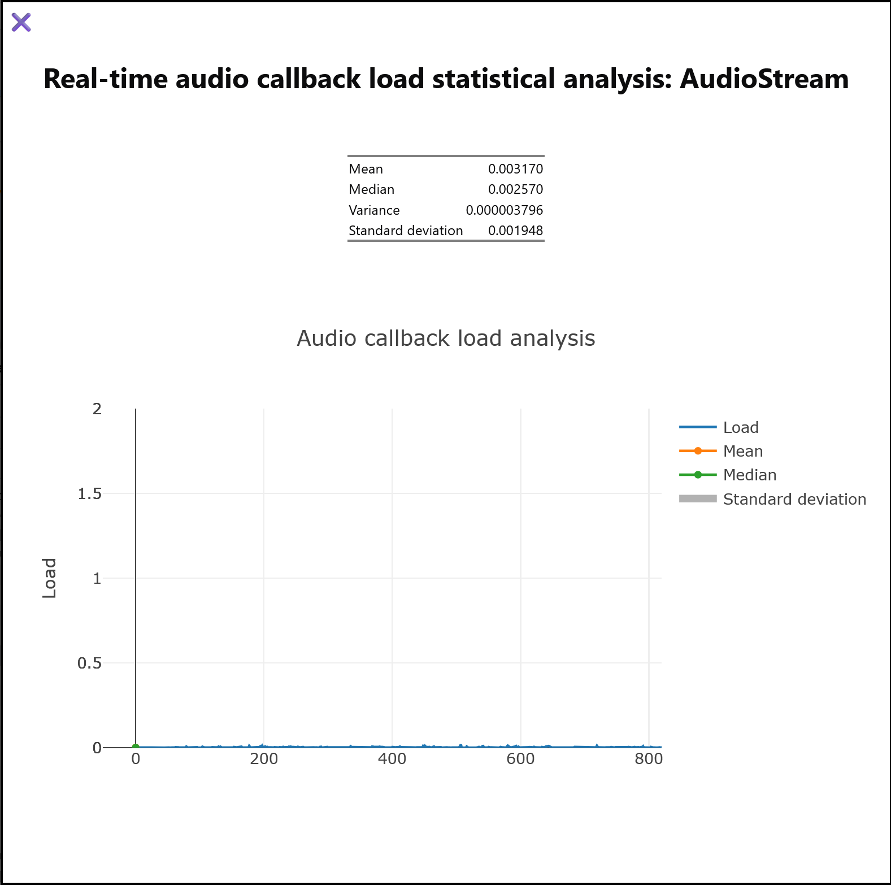
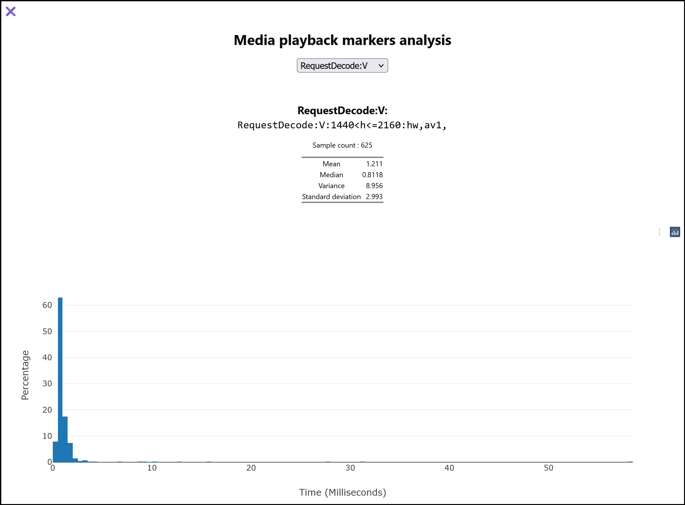
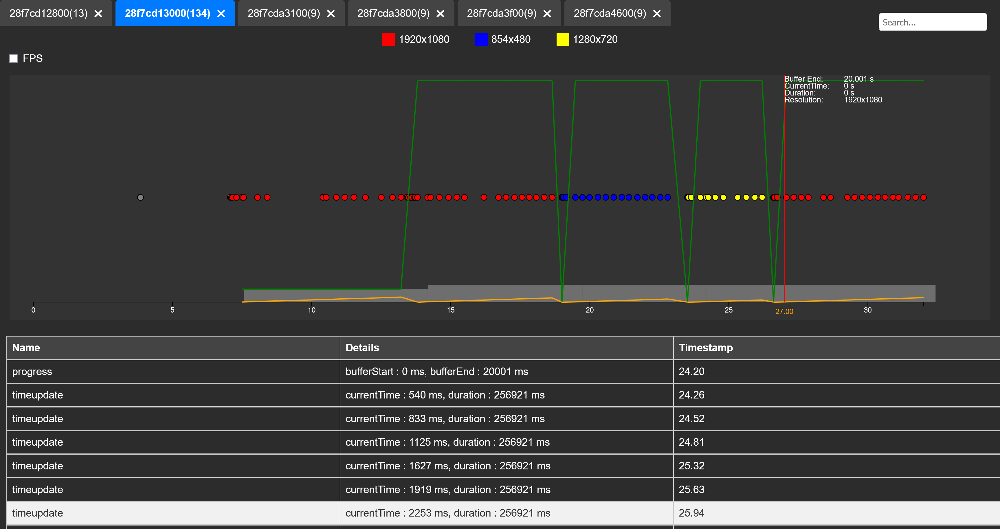
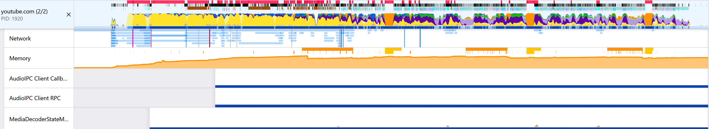

# `fx-profiler-audio-cb`

This extension is used to analysis the media statistics from the [Firefox
profiler](https://profiler.firefox.com/).

* Marker Visualization

  This feature enables statistical visualization for predefined markers used in various contexts. To view statistical visualizations for any marker, another extension, [Fouineur](https://padenot.github.io/fouineur/), is your best choice.

  * Real-time audio analysis
  
  * Decoding performance analysis
  

* Playback Restore :

  This feature allows users to restore playback to a specific point in time, making it easier to analyze and debug media playback issues.

  

# How To Use

## Installation
1. Download the latest `.xpi` from the [dist directory](https://github.com/padenot/fx-profiler-audio-cb/tree/master/dist). This is signed by
<https://addons.mozilla.org>.
2. Go to `about:addons` and click the gear icon, then select `Install Add-on From File`.
3. Select the downloaded `.xpi` file and install it

## Marker Visualization
1. Open any profile captured under `Media Playback` preset [1]
2. Find the tab which contains the media you want to analyze
3. > For **real-time audio**, select `AudioIPC Client Callback` thread.
   >
   > For **decoding performance**, select `MediaDecoderStateMachine`, `MediaSupervisor` threads.
4. Click the extension icon and select `Marker Visualization`

Note, if you want to analysis the performance of **video decoder**, you need to choose `MediaPDecoder` thread in either `GPU` or `RDD` process.

## Playback Restore

1. Open any profile captured under `Media Playback` preset [1]
2. Find the tab which contains the media you want to analyze
3. Keep only main thread selected, which mean only selecting the tab
    
4. Click the extension icon and select `Playback Restore`

[1] [Instruction of how to capture a media profile](https://www.loom.com/share/24ea3a8e3a054c478de94643a0ea8620?sid=87b0ffaa-c4ea-43ce-8107-639f24b747a8)

# Development

Install
[`webext-run`](https://extensionworkshop.com/documentation/develop/getting-started-with-web-ext/),
and run `web-ext run` in the top level directory.

# License

MPL 2.0
